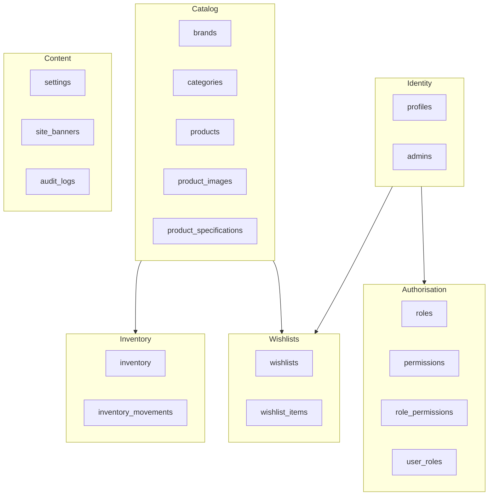

# Database documentation

Reference for the Bondo schema as built in Phase 2. Every diagram and table
here was generated from the migrated schema by introspecting `pg_catalog` and
`information_schema`, not written from memory.

| Document                                | Covers                                                               |
| --------------------------------------- | -------------------------------------------------------------------- |
| [Entity relationship diagram](erd.md)   | Every table, its columns, and the full ERD                           |
| [Table relationships](relationships.md) | All 34 foreign keys, cascade rules, and why each was chosen          |
| [Permission graph](permissions.md)      | Roles, permissions, and the complete RLS policy matrix               |
| [Storage architecture](storage.md)      | The 5 buckets, their policies, and the public/private split          |
| [Inventory flow](inventory.md)          | The ledger, the guard trigger, and how stock actually moves          |
| [Product model](product-model.md)       | The current single-SKU model and the **not-yet-built** variant model |

---

## At a glance

| Metric                   | Count |
| ------------------------ | ----: |
| Tables (`public`)        |    18 |
| Enums                    |     4 |
| Foreign keys             |    34 |
| — structural             |    16 |
| — audit columns (`*_by`) |    18 |
| Check constraints        |    51 |
| Indexes                  |    58 |
| RLS policies (`public`)  |    45 |
| RLS policies (`storage`) |    10 |
| Triggers                 |    23 |
| Functions (`public`)     |    14 |
| Permissions              |    20 |
| System roles             |     5 |
| Storage buckets          |     5 |
| Migrations               |     9 |

These figures are duplicated in
[PROJECT_STATUS.md § Current database status](../../PROJECT_STATUS.md#current-database-status).
If the two disagree, the schema is right and both documents are wrong.

---

## Domains

The schema divides into six domains. Nothing crosses a domain boundary except
through a foreign key drawn in [relationships.md](relationships.md).

---

## Conventions applied to every table

| Column                      | Applied to                                                   | Maintained by                        |
| --------------------------- | ------------------------------------------------------------ | ------------------------------------ |
| `id uuid` primary key       | all except `inventory`, `settings`, join tables              | `gen_random_uuid()` default          |
| `created_at timestamptz`    | all 18                                                       | `now()` default                      |
| `updated_at timestamptz`    | 11 mutable tables                                            | `set_updated_at()` BEFORE UPDATE     |
| `created_by` / `updated_by` | 8 admin-managed tables                                       | `set_row_actor()`, from `auth.uid()` |
| `deleted_at timestamptz`    | `products`, `categories`, `brands`, `admins`, `site_banners` | application                          |

`created_by` is immutable: `set_row_actor()` reasserts the stored value on
UPDATE rather than trusting what the client sent. `auth.uid()` is NULL for
service-role and for migrations, jobs and seeds, so NULL means "the system did
this" — a meaningful value, not an error.

**Soft delete is applied only where a row is referenced by history that must
survive it.** Rows owned entirely by one user (`wishlists`) are hard-deleted
because "delete" must mean delete for the person who owns the data, and
append-only ledgers (`inventory_movements`, `audit_logs`) are never deleted at
all.

---

## Keeping this synchronised

These documents are hand-written prose around machine-extracted facts. When the
schema changes:

1. Add the migration.
2. Update the affected document(s) here — the FK table in
   [relationships.md](relationships.md), the policy matrix in
   [permissions.md](permissions.md), and the counts above.
3. Update the same counts in
   [PROJECT_STATUS.md](../../PROJECT_STATUS.md#current-database-status).
4. Run `npm run db:types` and commit the regenerated types.

Step 4 is currently blocked — see **K-3**. `types/database.ts` still describes
an empty schema, so `supabase.from("products")` will not compile until
`npm run db:types` runs on a machine with Docker.
