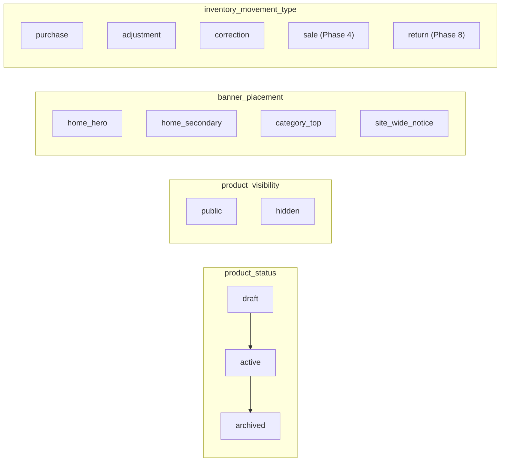

# Entity relationship diagram

Generated from the migrated schema. `auth.users` is Supabase's table, shown
because eight of ours reference it.

---

## Full ERD

Audit columns (`created_by`, `updated_by`) are omitted from the relationship
lines below — all 18 of them point at `auth.users` with `ON DELETE SET NULL`,
and drawing them would bury the 16 relationships that carry meaning. They are
listed in full in [relationships.md](relationships.md).

```mermaid
erDiagram
    auth_users ||--|| profiles : "shares primary key"
    auth_users ||--o| admins : "may be staff"
    auth_users ||--o{ user_roles : "holds"
    auth_users ||--o{ wishlists : "owns"
    auth_users ||--o{ audit_logs : "acted"

    roles ||--o{ user_roles : "granted to"
    roles ||--o{ role_permissions : "carries"
    permissions ||--o{ role_permissions : "granted by"

    brands ||--o{ products : "manufactures"
    categories ||--o{ products : "classifies"
    categories ||--o{ categories : "parent of"

    products ||--|| inventory : "has stock"
    products ||--o{ inventory_movements : "stock history"
    products ||--o{ product_images : "shown by"
    products ||--o{ product_specifications : "described by"
    products ||--o{ wishlist_items : "saved as"

    wishlists ||--o{ wishlist_items : "contains"

    auth_users {
        uuid id PK
        text email UK
    }

    profiles {
        uuid id PK "= auth.users.id"
        text full_name
        text avatar_path "key in avatars bucket"
        text phone
        timestamptz created_at
        timestamptz updated_at
    }

    admins {
        uuid id PK
        uuid user_id UK "FK auth.users"
        boolean is_active "false revokes access immediately"
        text job_title
        text notes
        timestamptz last_seen_at
        timestamptz deleted_at "soft delete"
    }

    roles {
        uuid id PK
        text key UK "super_admin, catalog_manager, ..."
        text name
        text description
        boolean is_system "protected from rename and delete"
    }

    permissions {
        uuid id PK
        text key UK "resource.action"
        text resource
        text action
        text description
    }

    role_permissions {
        uuid role_id PK "FK roles"
        uuid permission_id PK "FK permissions"
        timestamptz created_at
    }

    user_roles {
        uuid user_id PK "FK auth.users"
        uuid role_id PK "FK roles"
        timestamptz granted_at
        uuid granted_by "FK auth.users"
    }

    brands {
        uuid id PK
        text slug UK "unique among live rows"
        text name
        text description
        text logo_path "key in brands bucket"
        text website_url "http or https only"
        boolean is_featured
        boolean is_visible
        text seo_title
        text seo_description
        timestamptz deleted_at "soft delete"
    }

    categories {
        uuid id PK
        uuid parent_id FK "self, RESTRICT"
        text slug UK "unique among live rows"
        text name
        text description
        text image_path
        uuid_array path "root-to-self, trigger-maintained"
        integer depth "0 for roots, trigger-maintained"
        integer display_order
        boolean is_visible
        text seo_title
        text seo_description
        timestamptz deleted_at "soft delete"
    }

    products {
        uuid id PK
        text sku UK "unique among live rows"
        text slug UK "unique among live rows"
        text name
        text short_description
        text description
        uuid brand_id FK "RESTRICT"
        uuid category_id FK "RESTRICT"
        product_status status "draft, active, archived"
        product_visibility visibility "public, hidden"
        boolean is_featured
        integer price_cents "integer minor units"
        integer sale_price_cents "must be below price_cents"
        integer cost_price_cents "internal only"
        integer weight_grams
        integer length_mm
        integer width_mm
        integer height_mm
        integer warranty_months
        text seo_title
        text seo_description
        text_array search_keywords "no NULL elements"
        tsvector search_vector "GENERATED, weighted A-D"
        timestamptz published_at "future value schedules publication"
        timestamptz deleted_at "soft delete"
    }

    product_images {
        uuid id PK
        uuid product_id FK "CASCADE"
        text storage_path "key in products bucket"
        text alt_text
        integer display_order
        boolean is_primary "at most one true per product"
        integer width
        integer height
    }

    product_specifications {
        uuid id PK
        uuid product_id FK "CASCADE"
        text spec_group "Display, Connectivity, ..."
        text name "unique per product and group"
        text value
        text unit
        integer display_order
    }

    inventory {
        uuid product_id PK "FK products, CASCADE"
        integer quantity_on_hand "ledger-only, guarded"
        integer quantity_reserved "unused until Phase 4"
        integer low_stock_threshold
        boolean allow_backorder
    }

    inventory_movements {
        uuid id PK
        uuid product_id FK "CASCADE"
        inventory_movement_type movement_type
        integer quantity_delta "signed, never zero"
        integer quantity_after "stamped by trigger"
        text reason
        text reference "PO number, later an order id"
        timestamptz created_at
        uuid created_by
    }

    settings {
        text key PK "lowercase dotted"
        jsonb value
        text description
        boolean is_public "anonymous read flag"
    }

    site_banners {
        uuid id PK
        text title
        text subtitle
        text image_path
        text link_url "relative or http(s)"
        banner_placement placement
        integer display_order
        boolean is_active
        timestamptz starts_at "null means already live"
        timestamptz ends_at "null means until switched off"
        timestamptz deleted_at "soft delete"
    }

    audit_logs {
        uuid id PK
        uuid actor_id FK "SET NULL"
        text actor_email "copied, survives deletion"
        text action "resource.verb"
        text resource_type
        uuid resource_id
        jsonb changes
        jsonb metadata
        inet ip_address
        text user_agent
        timestamptz created_at
    }

    wishlists {
        uuid id PK
        uuid user_id FK "CASCADE"
        text name
        boolean is_default "at most one true per user"
        timestamptz created_at
        timestamptz updated_at
    }

    wishlist_items {
        uuid id PK
        uuid wishlist_id FK "CASCADE"
        uuid product_id FK "CASCADE"
        text note
        timestamptz created_at
    }
```

---

## Enums

| Enum                      | Values                                                            | Notes                                                                                                                       |
| ------------------------- | ----------------------------------------------------------------- | --------------------------------------------------------------------------------------------------------------------------- |
| `product_status`          | `draft`, `active`, `archived`                                     | Editorial lifecycle. Only `active` is sellable.                                                                             |
| `product_visibility`      | `public`, `hidden`                                                | Orthogonal to status — an `active` product can be `hidden` while photography is redone.                                     |
| `banner_placement`        | `home_hero`, `home_secondary`, `category_top`, `site_wide_notice` | An enum because the storefront needs a component per placement; an unknown value renders nothing.                           |
| `inventory_movement_type` | `purchase`, `adjustment`, `correction`, `sale`, `return`          | `sale` and `return` are declared but unused until Phases 4 and 8, so the ledger never needs an enum migration mid-checkout. |

`status` and `visibility` are independent on purpose. The combination a shopper
sees is `status = 'active' AND visibility = 'public' AND published_at <= now()`
— all three, which is exactly what the anonymous read policy checks.

---

## Generated and derived columns

| Column                               | How it is produced                            | Why not maintained in the application                                                   |
| ------------------------------------ | --------------------------------------------- | --------------------------------------------------------------------------------------- |
| `products.search_vector`             | `GENERATED ALWAYS ... STORED`                 | Postgres guarantees it can never drift from its inputs.                                 |
| `categories.path`                    | `categories_set_path()` BEFORE INSERT/UPDATE  | A wrong path silently corrupts every subtree query.                                     |
| `categories.depth`                   | same trigger                                  | Derived from `path`; never written by hand.                                             |
| `inventory.quantity_on_hand`         | `apply_inventory_movement()` on ledger insert | Two writable copies of a quantity are two quantities. See [inventory.md](inventory.md). |
| `inventory_movements.quantity_after` | stamped by the same trigger                   | Client-supplied values are overwritten, so the ledger self-audits.                      |

`search_vector` weighting, highest first:

| Weight | Source              | Text search config | Reason                                     |
| ------ | ------------------- | ------------------ | ------------------------------------------ |
| A      | `name`, `sku`       | `simple`           | No stemming, so `4090` and `RTX` survive.  |
| B      | `search_keywords`   | `simple`           | Curated synonyms, matched literally.       |
| C      | `short_description` | `english`          | Prose; stemming is what the shopper wants. |
| D      | `description`       | `english`          | Same, lowest priority.                     |

> Every function in a generated column must be `IMMUTABLE`. `array_to_string()`
> is `STABLE`, so the obvious spelling is rejected with "generation expression
> is not immutable" — `array_to_tsvector()` is the immutable way to fold a
> `text[]` in, and `to_tsvector` needs its two-argument `regconfig` form.
