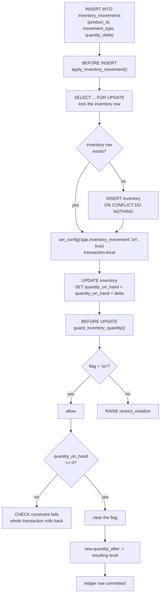
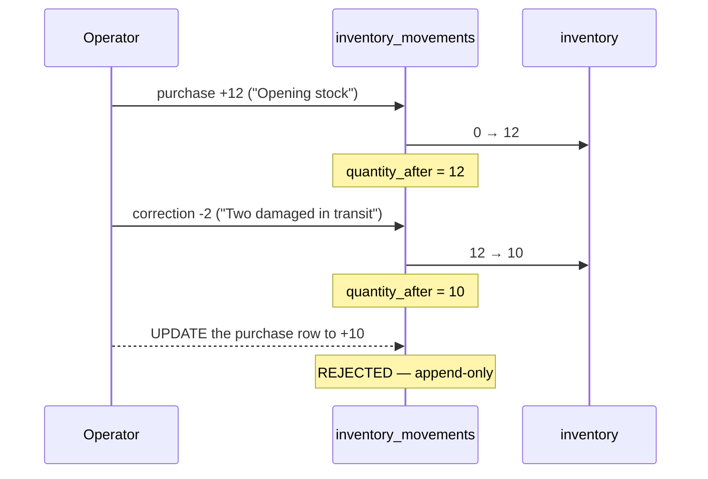
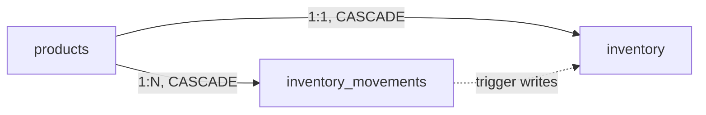

# Inventory flow

The requirement was "never overwrite inventory silently; always create movement
records". That is enforced by the database, not documented and hoped for.

```
inventory            one row per product — the current level
inventory_movements  append-only ledger of every change
```

`quantity_on_hand` is **derived state**. It exists because summing the ledger on
every product page would not survive 50,000 products. It is kept correct by a
trigger on the ledger, and a second trigger rejects any attempt to change it by
another route (ADR-24).

`products` has no stock column. Two writable copies of a number are two numbers.

---

## The write path



Five properties fall out of this, each verified:

| Property                                        | Mechanism                                                                                                           |
| ----------------------------------------------- | ------------------------------------------------------------------------------------------------------------------- |
| Stock cannot change without a ledger row        | `guard_inventory_quantity()` raises unless the movement trigger set the flag                                        |
| Concurrent movements cannot lose an update      | `SELECT ... FOR UPDATE` serialises them for the rest of the transaction                                             |
| Stock cannot go negative                        | `CHECK (quantity_on_hand >= 0)` — an over-large negative movement aborts the whole transaction, ledger row included |
| The client cannot lie about the resulting level | `quantity_after` is overwritten by the trigger, whatever was supplied                                               |
| History cannot be rewritten                     | `reject_ledger_mutation()` on UPDATE and DELETE, binding `service_role` too                                         |

The handshake between the two triggers is a **transaction-local** GUC
(`set_config(..., is_local => true)`), so it dies with the transaction and
cannot leak into the next statement on a pooled connection.

---

## What the guard actually blocks

```sql
-- Rejected. This is the whole point.
update inventory set quantity_on_hand = 500 where product_id = '...';
-- ERROR: quantity_on_hand may only change by inserting into inventory_movements
-- HINT:  Insert an inventory_movements row with the desired quantity_delta.

-- Allowed. These columns are ordinary settings.
update inventory set low_stock_threshold = 5, allow_backorder = true
where product_id = '...';

-- The supported way to move stock.
insert into inventory_movements (product_id, movement_type, quantity_delta, reason)
values ('...', 'purchase', 24, 'PO-2026-0031');
```

Someone in Supabase Studio typing a new number into the quantity column gets an
exception, not a silent divergence between the level and its history.

The RLS policy and the trigger answer different questions and agree by design:
the **policy** decides who may touch the row (`inventory.adjust`), the
**trigger** decides which column may move.

---

## Movement types

| Type         | Sign     | Meaning                                                 | Status                         |
| ------------ | -------- | ------------------------------------------------------- | ------------------------------ |
| `purchase`   | positive | Stock arriving from a supplier                          | in use                         |
| `adjustment` | either   | Deliberate operational change — damage, loss, promotion | in use                         |
| `correction` | either   | Fixing an earlier mistake, e.g. after a stock count     | in use                         |
| `sale`       | negative | Checkout                                                | **declared, unused — Phase 4** |
| `return`     | positive | Customer return                                         | **declared, unused — Phase 8** |

`sale` and `return` are declared now precisely so the ledger never needs an
enum migration in the middle of building checkout.

`quantity_delta` is signed and **may not be zero** — a zero-quantity movement is
always a bug in the caller, so it is rejected rather than recorded.

---

## Correcting a mistake

History is history. A wrong movement is corrected by recording a compensating
one, never by editing the original.



Storing `quantity_after` on each row makes the ledger auditable on its own: a
reader can verify the running total without replaying every prior movement.

Verified end to end: `12 − 2 = 10`, and a client-supplied `quantity_after` of
`99999` was overwritten with the true value.

---

## Reading stock



Every product gets an inventory row at birth, created by
`create_inventory_for_product()` AFTER INSERT on `products`. Without it,
"in stock?" becomes a NULL check at every call site.

| Column                | Meaning                                                                                                                                |
| --------------------- | -------------------------------------------------------------------------------------------------------------------------------------- |
| `quantity_on_hand`    | Physically present. Ledger-driven, guarded.                                                                                            |
| `quantity_reserved`   | Committed to unfulfilled orders. **Unused until Phase 4** (D-10).                                                                      |
| `low_stock_threshold` | Reorder trigger point. Directly editable.                                                                                              |
| `allow_backorder`     | Off by default — most computer parts are not restockable on demand, and a false backorder promise is worse than an out-of-stock label. |

Available stock, once Phase 4 populates reservations, is
`quantity_on_hand - quantity_reserved`. The constraint
`quantity_reserved <= quantity_on_hand` is the oversell guard that work will
lean on.

### Indexes

| Index                                    | Serves                                                                                                                    |
| ---------------------------------------- | ------------------------------------------------------------------------------------------------------------------------- |
| `idx_inventory_low_stock`                | The reorder report. Partial on `quantity_on_hand <= low_stock_threshold`, so it never scans comfortably stocked products. |
| `idx_inventory_movements_product_recent` | "Why is this number what it is" — per-product history, newest first.                                                      |
| `idx_inventory_movements_recent`         | The global recent-activity feed on the inventory dashboard.                                                               |

---

## Stock is not public

`inventory` has **no anonymous policy and no `anon` GRANT**. Exact stock levels
and reorder thresholds are competitive information.

"Only 3 left" is a merchandising decision Phase 3 will make deliberately —
through a view or a service that exposes _availability_ without the precise
figure. Leaking the exact number by default is not that decision.

---

## Known limitation

`quantity_reserved` is declared but nothing writes it (**D-10**). Until Phase 4,
`quantity_on_hand` alone describes availability. This is deliberate: the column
exists now so that available stock has a stable definition from the start, and
so checkout does not need a schema migration mid-phase.
