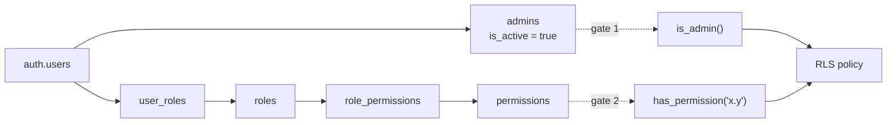
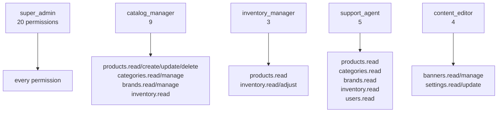

# Permission graph

Authorisation is a graph, not a flag. A user holds roles; roles hold
permissions. Nothing grants a permission to a user directly (ADR-21).

At 100+ administrators, per-user grants become impossible to audit. Revoking a
capability from everyone who has it must be one `DELETE FROM role_permissions`,
not a migration that walks the user table.

---

## The chain



**Two independent gates.** `admins` membership answers "is this person staff at
all"; the role graph answers "may they do this specific thing". A user must
clear both. Deactivating an admin (`is_active = false`) short-circuits the first
gate and revokes everything instantly, without touching a single role grant —
verified: a deactivated admin drops to anonymous visibility immediately.

Staff status lives in its own table rather than as an `is_admin` column on
`profiles` (ADR-22). `profiles` is the one table customers may `UPDATE`; a
privilege flag on it is one mis-scoped policy away from self-service escalation.

---

## The two functions every policy calls

```sql
public.is_admin() returns boolean
public.has_permission(permission_key text) returns boolean
```

Both are `STABLE SECURITY DEFINER SET search_path = ''` (ADR-23).

| Property               | Why it is required, not stylistic                                                                                                                                                                                                      |
| ---------------------- | -------------------------------------------------------------------------------------------------------------------------------------------------------------------------------------------------------------------------------------- |
| `SECURITY DEFINER`     | A policy on `user_roles` that queried `user_roles` would recurse forever. Running as the owner bypasses RLS on the tables read and breaks the cycle.                                                                                   |
| `SET search_path = ''` | Without it a caller can prepend a schema to `search_path` and shadow `public.admins` with their own table — which a DEFINER function would then read with elevated rights. Every reference inside is schema-qualified for this reason. |
| `STABLE`               | Lets the planner cache the result within a statement instead of re-evaluating per row.                                                                                                                                                 |
| `(select auth.uid())`  | Wrapping makes the planner treat it as an InitPlan evaluated once, not once per row. On a 50,000-row scan the difference is large.                                                                                                     |

Verified programmatically: all 7 `SECURITY DEFINER` functions in `public` pin
`search_path`.

---

## Permissions — 20

`resource.action`, stored split out so the admin UI can group by resource
without parsing strings.

| Resource     | Permissions                          |
| ------------ | ------------------------------------ |
| `products`   | `read`, `create`, `update`, `delete` |
| `categories` | `read`, `manage`                     |
| `brands`     | `read`, `manage`                     |
| `inventory`  | `read`, `adjust`                     |
| `banners`    | `read`, `manage`                     |
| `settings`   | `read`, `update`                     |
| `users`      | `read`, `update`, `assign_roles`     |
| `admins`     | `manage`                             |
| `roles`      | `manage`                             |
| `audit`      | `read`                               |

`permissions` has **no write policy at all**. The vocabulary of what the system
can do is defined by migrations. Inventing a permission at runtime would create
a key that no policy references and no code checks — an authorisation illusion.

---

## Roles — 5, all system roles



| Role                | Count | Grants                                                                                                            |
| ------------------- | ----: | ----------------------------------------------------------------------------------------------------------------- |
| `super_admin`       |    20 | Everything. Populated by a set-based `CROSS JOIN`, so adding a permission in a later migration keeps it complete. |
| `catalog_manager`   |     9 | `products.read/create/update/delete`, `categories.read/manage`, `brands.read/manage`, `inventory.read`            |
| `inventory_manager` |     3 | `products.read`, `inventory.read`, `inventory.adjust`                                                             |
| `support_agent`     |     5 | `products.read`, `categories.read`, `brands.read`, `inventory.read`, `users.read` — read-only throughout          |
| `content_editor`    |     4 | `banners.read`, `banners.manage`, `settings.read`, `settings.update`                                              |

All five have `is_system = true` and are protected by the
`roles_protect_system` trigger: they cannot be deleted, renamed, or demoted out
of system status. Application code branches on these keys, so a runtime rename
would silently change who can do what. Their `description` remains editable.

Note that `support_agent` gets `users.read` but **not** `inventory.adjust`, and
`inventory_manager` gets `inventory.adjust` but **not** `users.read`. Roles are
scoped to a job, not stacked by seniority.

---

## RLS policy matrix — 45 policies on `public`

Read as: _this role, with this permission, may do this._ `service_role` appears
nowhere because it bypasses RLS entirely — which is why `supabase/admin.ts` is
guarded by `server-only`.

### Anonymous (`anon`)

| Table                    | Access | Condition                                                                                  |
| ------------------------ | ------ | ------------------------------------------------------------------------------------------ |
| `products`               | SELECT | `deleted_at IS NULL AND status='active' AND visibility='public' AND published_at <= now()` |
| `product_images`         | SELECT | parent product passes the same test (`is_product_published()`)                             |
| `product_specifications` | SELECT | same                                                                                       |
| `categories`             | SELECT | `deleted_at IS NULL AND is_visible`                                                        |
| `brands`                 | SELECT | `deleted_at IS NULL AND is_visible`                                                        |
| `settings`               | SELECT | `is_public`                                                                                |
| `site_banners`           | SELECT | active, not deleted, and inside its `starts_at`/`ends_at` window                           |

Everything else — `profiles`, `admins`, `roles`, `permissions`,
`role_permissions`, `user_roles`, `inventory`, `inventory_movements`,
`audit_logs`, `wishlists`, `wishlist_items` — has **no `anon` policy and no
`anon` GRANT**. Both gates are shut (ADR-30).

> The brief said "read published products only". This extends that to the
> catalog metadata a product page needs — a product page must name its brand and
> the nav must list categories. Restricting those would push the whole storefront
> onto the service-role key, defeating the point of RLS. Recorded as **ADR-28**.

`published_at <= now()` is what makes scheduled publishing work with no cron
job: a future timestamp is simply not visible yet.

### Authenticated customer (no roles)

| Table            | Access | Condition                                                            |
| ---------------- | ------ | -------------------------------------------------------------------- |
| `profiles`       | SELECT | `id = auth.uid()`                                                    |
| `profiles`       | UPDATE | `id = auth.uid()`, same in `WITH CHECK`                              |
| `user_roles`     | SELECT | `user_id = auth.uid()` — see own grants so the UI can render its nav |
| `wishlists`      | ALL    | `user_id = auth.uid()`                                               |
| `wishlist_items` | ALL    | parent wishlist is theirs                                            |
| _catalog tables_ | SELECT | same anonymous conditions                                            |

No INSERT policy on `profiles`: rows arrive via `handle_new_user()`, a
`SECURITY DEFINER` trigger on `auth.users`. No DELETE policy: profiles die with
their auth user.

Verified: a customer cannot read another user's profile, cannot update one,
cannot read inventory/admins/audit, cannot insert a product, and **cannot grant
themselves a role**.

### Staff

| Table                    | Command | Required permission      |
| ------------------------ | ------- | ------------------------ |
| `products`               | SELECT  | `products.read`          |
| `products`               | INSERT  | `products.create`        |
| `products`               | UPDATE  | `products.update`        |
| `products`               | DELETE  | `products.delete`        |
| `product_images`         | SELECT  | `products.read`          |
| `product_images`         | ALL     | `products.update`        |
| `product_specifications` | SELECT  | `products.read`          |
| `product_specifications` | ALL     | `products.update`        |
| `categories`             | SELECT  | `categories.read`        |
| `categories`             | ALL     | `categories.manage`      |
| `brands`                 | SELECT  | `brands.read`            |
| `brands`                 | ALL     | `brands.manage`          |
| `inventory`              | SELECT  | `inventory.read`         |
| `inventory`              | UPDATE  | `inventory.adjust`       |
| `inventory_movements`    | SELECT  | `inventory.read`         |
| `inventory_movements`    | INSERT  | `inventory.adjust`       |
| `settings`               | SELECT  | `settings.read`          |
| `settings`               | ALL     | `settings.update`        |
| `site_banners`           | SELECT  | `banners.read`           |
| `site_banners`           | ALL     | `banners.manage`         |
| `profiles`               | SELECT  | `users.read`             |
| `profiles`               | UPDATE  | `users.update`           |
| `audit_logs`             | SELECT  | `audit.read`             |
| `audit_logs`             | INSERT  | `is_admin()` — any admin |
| `roles`                  | SELECT  | `is_admin()`             |
| `roles`                  | ALL     | `roles.manage`           |
| `permissions`            | SELECT  | `is_admin()`             |
| `role_permissions`       | SELECT  | `is_admin()`             |
| `role_permissions`       | ALL     | `roles.manage`           |
| `user_roles`             | SELECT  | `is_admin()`             |
| `user_roles`             | ALL     | `users.assign_roles`     |
| `admins`                 | SELECT  | `is_admin()`             |
| `admins`                 | ALL     | `admins.manage`          |

Three deliberate asymmetries:

- **`audit_logs` INSERT is open to any admin, SELECT is gated on `audit.read`.**
  Every privileged action should produce an entry; gating writes would mean an
  admin lacking that permission acts unaudited. Reading is the sensitive
  operation, not writing.
- **`roles`, `permissions`, `role_permissions` and `user_roles` are readable by
  any admin.** The admin UI must render what a role is called before it can ask
  whether you may change it.
- **`inventory` UPDATE is granted but cannot change stock.** The policy decides
  who may touch the row; the `inventory_guard_quantity` trigger decides which
  column may move. `inventory.adjust` edits `low_stock_threshold` and
  `allow_backorder` only — see [inventory.md](inventory.md).

### Nobody

| Table                 | Denied commands        | Enforced by                                          |
| --------------------- | ---------------------- | ---------------------------------------------------- |
| `inventory_movements` | UPDATE, DELETE         | Trigger + revoked GRANT — binds `service_role` too   |
| `audit_logs`          | UPDATE, DELETE         | Same                                                 |
| `permissions`         | INSERT, UPDATE, DELETE | No policy + revoked GRANT                            |
| `inventory`           | INSERT                 | No policy; rows created by trigger on product insert |

RLS alone cannot stop `service_role`, so append-only is enforced by trigger
(ADR-27). An audit log that anyone holding the service key can rewrite is not
evidence of anything.

---

## GRANTs — the outer gate

Postgres access control is two gates and **both** must open: `GRANT` asks "may
this role touch this table at all", RLS asks "which rows". Supabase's default
privileges would grant `anon` access to every new table automatically; the
grants are written out explicitly instead so the model is reviewable (ADR-30).

| Role            | Grant                                                                       |
| --------------- | --------------------------------------------------------------------------- |
| `anon`          | SELECT on exactly the 7 tables with an anonymous read policy — nothing else |
| `authenticated` | SELECT/INSERT/UPDATE/DELETE on all tables, minus the revocations below      |
| `service_role`  | ALL on all tables and sequences                                             |

Revoked from `authenticated`:

- `inventory_movements` — UPDATE, DELETE
- `audit_logs` — UPDATE, DELETE
- `permissions` — INSERT, UPDATE, DELETE

`authenticated` is granted broadly on purpose: "which authenticated users" is
precisely the question RLS answers, and answering it twice in two places is how
the two answers end up disagreeing. A customer holds no permissions, so every
admin policy evaluates false for them regardless.

Default privileges cover future tables for `authenticated` and `service_role`.
**`anon` is deliberately excluded** — a new table must not become world-readable
because someone created it. Each later phase grants `anon` explicitly, per
table, in the migration that adds its anonymous read policy.

---

## Verified behaviour

From the Phase 2 validation run:

| Assertion                                                            | Result |
| -------------------------------------------------------------------- | ------ |
| `anon` sees 3 of 6 seeded products (draft, hidden, scheduled hidden) | pass   |
| `anon` blocked from 8 non-public tables                              | pass   |
| `anon` reads exactly the 4 public settings                           | pass   |
| Customer sees only their own profile                                 | pass   |
| Customer cannot update another user's profile                        | pass   |
| Customer cannot grant themselves a role                              | pass   |
| Admin with `products.read` sees all 6 products                       | pass   |
| Deactivated admin drops to anonymous visibility                      | pass   |
| Deactivated admin loses inventory access                             | pass   |
| Wishlists invisible to every other user, admins included             | pass   |
| All `SECURITY DEFINER` functions pin `search_path`                   | pass   |
