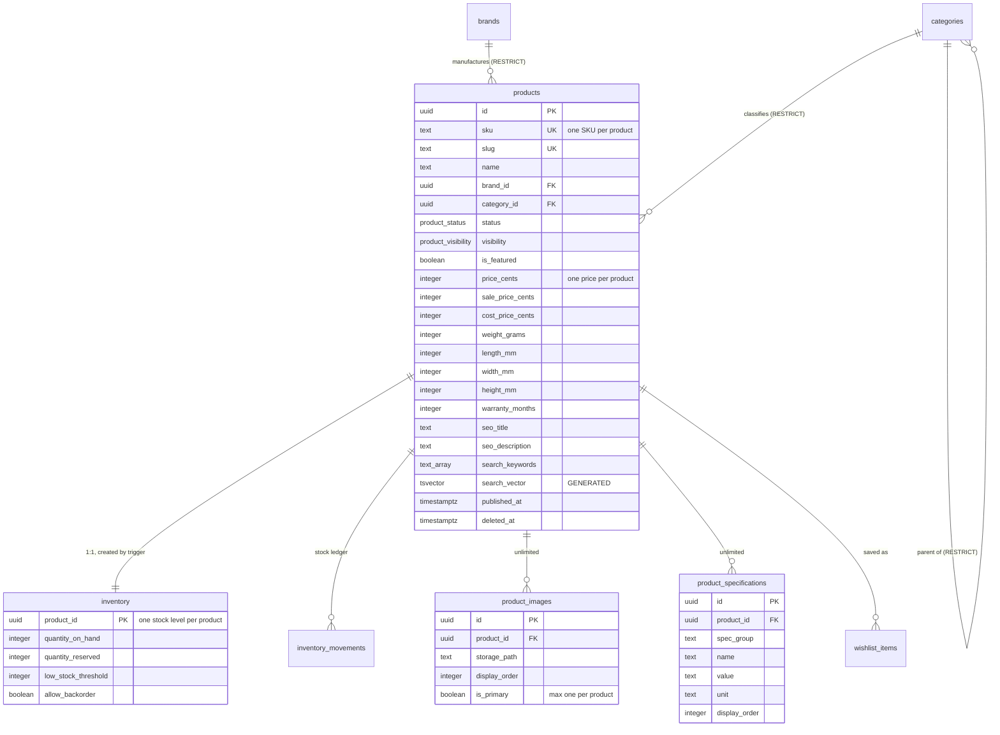
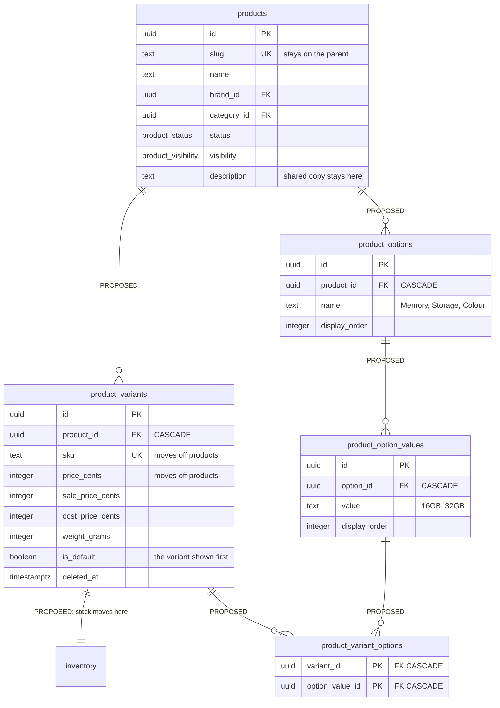

# Product model

> ## ⚠️ Read this before the diagrams
>
> **There is no `product_variants` table in the Bondo schema.** Phase 2 ships a
> **single-SKU product model**: one `products` row carries one SKU, one price
> and one stock level.
>
> A laptop sold in 16 GB and 32 GB configurations is therefore **two product
> rows** today.
>
> Part 2 of this document is a **design proposal that has not been built**. It
> is included because the gap is real and tracked as **D-8**, and because the
> decision of when to close it is expensive to get wrong. Nothing in Part 2
> exists in `supabase/migrations/`.

---

# Part 1 — The model that exists

## Everything the brief asked for, and where it lives

| Requirement      | Implementation                                                             |
| ---------------- | -------------------------------------------------------------------------- |
| SKU              | `products.sku` — `^[A-Z0-9][A-Z0-9._-]{1,63}$`, unique among live rows     |
| Slug             | `products.slug` — persisted, never derived (ADR-3), unique among live rows |
| Brand            | `products.brand_id` → `brands`, `ON DELETE RESTRICT`                       |
| Category         | `products.category_id` → `categories`, `ON DELETE RESTRICT`                |
| Status           | `product_status` enum: `draft`, `active`, `archived`                       |
| Visibility       | `product_visibility` enum: `public`, `hidden`                              |
| Featured         | `products.is_featured`, with its own partial index                         |
| Price            | `price_cents` — integer minor units (ADR-2)                                |
| Sale price       | `sale_price_cents` — constrained below `price_cents`                       |
| Cost price       | `cost_price_cents` — internal only, never anonymously readable             |
| Stock            | `inventory.quantity_on_hand` — **not** a product column (ADR-24)           |
| Weight           | `weight_grams`                                                             |
| Dimensions       | `length_mm`, `width_mm`, `height_mm`                                       |
| Warranty         | `warranty_months`                                                          |
| SEO title        | `seo_title`, max 120 chars                                                 |
| SEO description  | `seo_description`, max 320 chars                                           |
| Search keywords  | `search_keywords text[]`, no NULL elements, folded into `search_vector`    |
| Unlimited images | `product_images` — 1:N, at most one `is_primary`                           |
| Unlimited specs  | `product_specifications` — 1:N, unique per `(product, group, name)`        |

## Constraints that hold the model together

| Constraint                               | Prevents                                                                                             |
| ---------------------------------------- | ---------------------------------------------------------------------------------------------------- |
| `products_sale_price_valid`              | A "sale" price at or above list price                                                                |
| `products_active_requires_published_at`  | An `active` product nothing ever published — a state the storefront query would have to special-case |
| `products_keywords_no_nulls`             | A NULL array element, which makes `array_to_tsvector()` throw inside the generated column            |
| `products_price_non_negative`            | Negative money                                                                                       |
| `idx_products_sku_live` (partial unique) | Duplicate SKUs among live rows — while letting a soft-deleted SKU be reused                          |
| `idx_product_images_one_primary`         | Two primary images on one product                                                                    |
| `idx_product_specifications_unique_name` | The same attribute listed twice in one group                                                         |

`status` and `visibility` are independent. A shopper sees a product only when
**all three** of `status = 'active'`, `visibility = 'public'` and
`published_at <= now()` hold — which is exactly what the anonymous read policy
checks, and exactly the predicate the storefront indexes are partial on.

## Why specifications are rows, not columns

The useful attributes of a GPU (VRAM, board power, display outputs) and a
keyboard (switch type, layout, backlight) have nothing in common. Modelling them
as columns means either a table with 200 mostly-NULL columns or a migration
every time a new product category is stocked.

`spec_group` is free text rather than an enum for the same reason: the useful
groupings differ per category, and adding one must not need a migration.

---

# Part 2 — Variant model (PROPOSED — NOT BUILT)

> **None of this exists.** No migration creates these tables. This section
> documents the shape the schema would take, and the decision attached to it.

## Why there is no variant table today

The Phase 2 brief listed the tables to create, and `product_variants` was not
among them. Adding it unasked would have contradicted the standing rule against
building what nobody requested — so it was recorded as **D-8** instead, with the
cost of deferring it stated plainly.

## What the gap actually costs

| Consequence today                                                        | Severity                                      |
| ------------------------------------------------------------------------ | --------------------------------------------- |
| Each configuration needs its own `products` row                          | Workable — the SKU/slug uniqueness is per-row |
| Shared copy, images and specs are duplicated per configuration           | Editorial burden, grows with the catalog      |
| No "choose your RAM" control on a product page — they are separate pages | Weaker UX than competitors                    |
| Search returns near-duplicate results for one physical product           | Degrades as the catalog grows                 |
| Category and brand counts overstate the real catalog size                | Cosmetic                                      |

**The cost of adding it later is not the migration — it is the backfill.** Once
`order_items` (Phase 4) reference `products.id`, splitting a product row into a
parent plus variants means rewriting historical order lines, or accepting that
old orders point at a row that no longer means what it did. That is why D-8 is
marked _expensive after orders exist_.

## Proposed shape

### What would move, and what would stay

| Column                             | Today      | Proposed                              | Why                                               |
| ---------------------------------- | ---------- | ------------------------------------- | ------------------------------------------------- |
| `sku`                              | `products` | `product_variants`                    | A SKU identifies a sellable configuration         |
| `price_cents`                      | `products` | `product_variants`                    | 32 GB costs more than 16 GB                       |
| `sale_price_cents`                 | `products` | `product_variants`                    | Promotions run per configuration                  |
| `cost_price_cents`                 | `products` | `product_variants`                    | Cost differs per configuration                    |
| `weight_grams`                     | `products` | `product_variants`                    | Shipping cost follows the physical item           |
| `inventory.product_id`             | products   | `variant_id`                          | Stock is held per sellable unit                   |
| `slug`, `name`, `description`, SEO | `products` | unchanged                             | One page, one URL, one set of shared copy         |
| `brand_id`, `category_id`          | `products` | unchanged                             | Classification is a property of the product       |
| `product_images`                   | `products` | unchanged, plus optional `variant_id` | Most photography is shared; some is per-colour    |
| `product_specifications`           | `products` | unchanged                             | Specs describe the product, not the configuration |

### Migration sketch, if adopted

1. Create the five tables with RLS and policies in the same migration, per the
   standing rule.
2. For each existing product, create one `product_variants` row carrying its
   SKU, prices and weight, with `is_default = true`.
3. Repoint `inventory.product_id` → `inventory.variant_id`, moving each row to
   the default variant.
4. Repoint `inventory_movements.product_id` likewise.
5. Drop the moved columns from `products`.
6. Rebuild `search_vector` — SKU is no longer on the row, so weight A needs the
   variant SKUs aggregated in, which a generated column cannot do across tables.
   **The search vector would have to become trigger-maintained.**

Step 6 is the hidden cost. It is worth knowing before starting, not during.

### The decision

| Option                 | Argument                                                                                                                                    |
| ---------------------- | ------------------------------------------------------------------------------------------------------------------------------------------- |
| **Add before Phase 3** | Cheapest possible moment — no orders exist, no historical rows to rewrite, and the catalog pages get built once against the final shape.    |
| **Add before Phase 4** | Still safe; checkout has not written `order_items` yet. Catalog pages would need revisiting.                                                |
| **Defer past Phase 4** | Requires backfilling order history. Avoid.                                                                                                  |
| **Never**              | Defensible if the catalog stays configuration-free — accessories, single-spec components. Not defensible for laptops and prebuilt desktops. |

Bondo sells laptops and desktops, so "never" is unlikely to hold. The
recommendation recorded in D-8 is to decide **before Phase 3 begins**, because
that is when catalog pages start being written against whichever shape exists.

---

## Related

- [ERD](erd.md) — full column listing and the generated `search_vector`
- [Relationships](relationships.md) — cascade rules on every product FK
- [Inventory flow](inventory.md) — why stock is not a product column
- **D-8** in [PROJECT_STATUS.md](../../PROJECT_STATUS.md#technical-debt)
