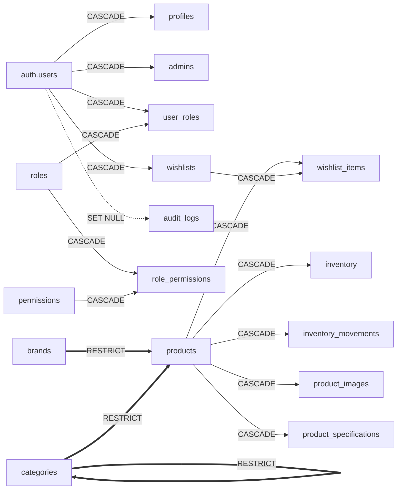
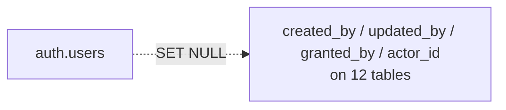
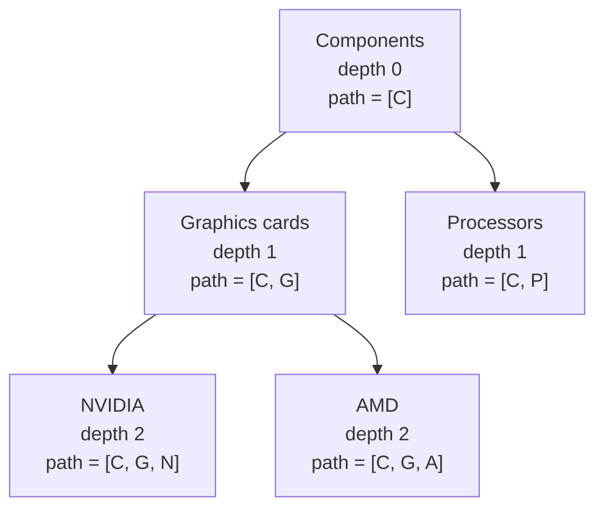

# Table relationships

All 34 foreign keys, with the delete rule for each and the reason it was chosen.

The delete rules are the interesting part. `CASCADE`, `RESTRICT` and `SET NULL`
each encode a different answer to "what should happen to this row when its
parent disappears", and getting one wrong is either silent data loss or an
operation nobody can perform.

---

## Structural relationships (16)

These carry the meaning of the schema.



Solid arrows are `CASCADE`, thick arrows are `RESTRICT`, dashed is `SET NULL`.

| #   | Child                    | Column          | Parent           | On delete    | Why                                                                                                                                                      |
| --- | ------------------------ | --------------- | ---------------- | ------------ | -------------------------------------------------------------------------------------------------------------------------------------------------------- |
| 1   | `profiles`               | `id`            | `auth.users.id`  | **CASCADE**  | Shares the parent's primary key. One identity, one key, no way for the two to disagree. Account deletion must remove the profile — GDPR, not preference. |
| 2   | `admins`                 | `user_id`       | `auth.users.id`  | **CASCADE**  | An admin record for a deleted account grants access to nobody and confuses every audit.                                                                  |
| 3   | `user_roles`             | `user_id`       | `auth.users.id`  | **CASCADE**  | A role grant to a deleted user is a dangling privilege.                                                                                                  |
| 4   | `user_roles`             | `role_id`       | `roles.id`       | **CASCADE**  | Deleting a role revokes it everywhere, atomically. System roles cannot be deleted at all — see the trigger.                                              |
| 5   | `role_permissions`       | `role_id`       | `roles.id`       | **CASCADE**  | Same reasoning from the other side.                                                                                                                      |
| 6   | `role_permissions`       | `permission_id` | `permissions.id` | **CASCADE**  | Removing a permission from the vocabulary removes every grant of it.                                                                                     |
| 7   | `products`               | `brand_id`      | `brands.id`      | **RESTRICT** | Deleting a brand must never silently delete its products. Retire a brand by soft-deleting it.                                                            |
| 8   | `products`               | `category_id`   | `categories.id`  | **RESTRICT** | Same. A miscategorised product should be recategorised, not destroyed.                                                                                   |
| 9   | `categories`             | `parent_id`     | `categories.id`  | **RESTRICT** | Deleting a branch must not orphan or silently remove its children. Soft-delete the branch instead.                                                       |
| 10  | `inventory`              | `product_id`    | `products.id`    | **CASCADE**  | Stock for a hard-deleted product is meaningless. Also the primary key, enforcing 1:1.                                                                    |
| 11  | `inventory_movements`    | `product_id`    | `products.id`    | **CASCADE**  | Ledger rows for a product that no longer exists cannot be reconciled against anything.                                                                   |
| 12  | `product_images`         | `product_id`    | `products.id`    | **CASCADE**  | An image has no meaning without its product, and orphaned rows are a slow storage leak.                                                                  |
| 13  | `product_specifications` | `product_id`    | `products.id`    | **CASCADE**  | Same.                                                                                                                                                    |
| 14  | `wishlist_items`         | `wishlist_id`   | `wishlists.id`   | **CASCADE**  | Deleting a list deletes its contents.                                                                                                                    |
| 15  | `wishlist_items`         | `product_id`    | `products.id`    | **CASCADE**  | A saved item pointing at nothing is a broken card in the UI. Note the _normal_ retirement path is a soft delete, which leaves the item in place.         |
| 16  | `wishlists`              | `user_id`       | `auth.users.id`  | **CASCADE**  | The user's data goes with the user.                                                                                                                      |

### The CASCADE / RESTRICT split, stated plainly

**CASCADE where the child cannot exist without the parent.** An image, a spec
row, a stock level, a wishlist entry — none of these mean anything on their own.

**RESTRICT where the child is independent and valuable.** Products outlive
brands and categories. A `DELETE FROM brands` that quietly removed 400 products
would be a catastrophe discovered days later; an error message is the correct
outcome.

Because deletes are restricted, **soft delete is the intended retirement path**
for `products`, `categories`, `brands`, `admins` and `site_banners`. The unique
indexes on `sku` and `slug` are partial on `deleted_at IS NULL`, so retiring a
product frees its identifiers for reuse — something a plain unique constraint
would forbid forever.

---

## Audit relationships (18)

Every one points at `auth.users` with `ON DELETE SET NULL`.



| Table                 | Columns                    |
| --------------------- | -------------------------- |
| `admins`              | `created_by`, `updated_by` |
| `brands`              | `created_by`, `updated_by` |
| `categories`          | `created_by`, `updated_by` |
| `products`            | `created_by`, `updated_by` |
| `roles`               | `created_by`, `updated_by` |
| `site_banners`        | `created_by`, `updated_by` |
| `inventory_movements` | `created_by`               |
| `product_images`      | `created_by`               |
| `role_permissions`    | `created_by`               |
| `settings`            | `updated_by`               |
| `user_roles`          | `granted_by`               |
| `audit_logs`          | `actor_id`                 |

**`SET NULL`, never `CASCADE`.** Deleting a departed employee's account must not
delete the products they created or the audit trail of what they did. The
record of the action outlives the actor — which is exactly when someone reads
it. `audit_logs` additionally copies `actor_email` at write time, so the entry
stays legible after the account is gone.

---

## Cardinality summary

| Relationship                          | Cardinality | Enforced by                                                               |
| ------------------------------------- | ----------- | ------------------------------------------------------------------------- |
| `auth.users` → `profiles`             | 1 : 1       | Shared primary key                                                        |
| `auth.users` → `admins`               | 1 : 0..1    | `UNIQUE (user_id)`                                                        |
| `products` → `inventory`              | 1 : 1       | `product_id` is the primary key; row created by trigger on product insert |
| `products` → `product_images`         | 1 : N       | At most one `is_primary` per product (partial unique index)               |
| `products` → `product_specifications` | 1 : N       | `UNIQUE (product_id, COALESCE(spec_group,''), name)`                      |
| `auth.users` → `wishlists`            | 1 : N       | At most one `is_default` per user (partial unique index)                  |
| `wishlists` ↔ `products`              | M : N       | `wishlist_items`, `UNIQUE (wishlist_id, product_id)`                      |
| `roles` ↔ `permissions`               | M : N       | `role_permissions`, composite primary key                                 |
| `auth.users` ↔ `roles`                | M : N       | `user_roles`, composite primary key                                       |
| `categories` → `categories`           | 1 : N       | Self-reference; cycles rejected by trigger                                |

The three join tables use **composite primary keys rather than a surrogate
`id`** — the pair _is_ the identity, which makes a duplicate grant impossible
rather than merely unlikely.

---

## The category tree

`parent_id` is the truth. `path` and `depth` are derived by
`categories_set_path()` and exist so a subtree query is one indexed containment
test rather than a recursive CTE on every page view.



```sql
-- Everything beneath Components, at any depth, in one indexed lookup:
select * from categories where path @> array['<components-id>'::uuid];
```

Two triggers maintain it:

| Trigger                          | Timing                               | Does                                                            |
| -------------------------------- | ------------------------------------ | --------------------------------------------------------------- |
| `categories_set_path`            | BEFORE INSERT OR UPDATE OF parent_id | Recomputes `path`/`depth`; raises on a cycle or missing parent  |
| `categories_rebuild_descendants` | AFTER UPDATE OF parent_id            | Rewrites every descendant's `path` when a branch is re-parented |

Without the second trigger, moving a branch would leave every node beneath it
holding a stale path, and the GIN index would start returning wrong answers
silently. **Cycles are rejected** — a cycle in a category tree is an infinite
loop in every breadcrumb.

Verified: 3-level nesting produces `depth = 2`; re-parenting rebuilds
descendants; both direct and indirect cycles raise.

---

## Triggers by table

23 triggers. Those on `auth.users` are ours, attached to Supabase's table.

| Table                 | Trigger                           | Timing / events      | Function                         |
| --------------------- | --------------------------------- | -------------------- | -------------------------------- |
| `auth.users`          | `on_auth_user_created`            | AFTER INSERT         | `handle_new_user`                |
| `profiles`            | `profiles_set_updated_at`         | BEFORE UPDATE        | `set_updated_at`                 |
| `admins`              | `admins_set_updated_at`           | BEFORE UPDATE        | `set_updated_at`                 |
| `admins`              | `admins_set_row_actor`            | BEFORE INSERT/UPDATE | `set_row_actor`                  |
| `roles`               | `roles_protect_system`            | BEFORE UPDATE/DELETE | `protect_system_roles`           |
| `roles`               | `roles_set_updated_at`            | BEFORE UPDATE        | `set_updated_at`                 |
| `roles`               | `roles_set_row_actor`             | BEFORE INSERT/UPDATE | `set_row_actor`                  |
| `brands`              | `brands_set_updated_at`           | BEFORE UPDATE        | `set_updated_at`                 |
| `brands`              | `brands_set_row_actor`            | BEFORE INSERT/UPDATE | `set_row_actor`                  |
| `categories`          | `categories_set_path`             | BEFORE INSERT/UPDATE | `categories_set_path`            |
| `categories`          | `categories_rebuild_descendants`  | AFTER UPDATE         | `categories_rebuild_descendants` |
| `products`            | `products_create_inventory`       | AFTER INSERT         | `create_inventory_for_product`   |
| `products`            | `products_set_updated_at`         | BEFORE UPDATE        | `set_updated_at`                 |
| `products`            | `products_set_row_actor`          | BEFORE INSERT/UPDATE | `set_row_actor`                  |
| `inventory`           | `inventory_guard_quantity`        | BEFORE UPDATE        | `guard_inventory_quantity`       |
| `inventory`           | `inventory_set_updated_at`        | BEFORE UPDATE        | `set_updated_at`                 |
| `inventory_movements` | `inventory_movements_apply`       | BEFORE INSERT        | `apply_inventory_movement`       |
| `inventory_movements` | `inventory_movements_append_only` | BEFORE UPDATE/DELETE | `reject_ledger_mutation`         |
| `audit_logs`          | `audit_logs_append_only`          | BEFORE UPDATE/DELETE | `reject_ledger_mutation`         |
| `settings`            | `settings_set_updated_at`         | BEFORE UPDATE        | `set_updated_at`                 |
| `site_banners`        | `site_banners_set_updated_at`     | BEFORE UPDATE        | `set_updated_at`                 |
| `site_banners`        | `site_banners_set_row_actor`      | BEFORE INSERT/UPDATE | `set_row_actor`                  |
| `wishlists`           | `wishlists_set_updated_at`        | BEFORE UPDATE        | `set_updated_at`                 |

`reject_ledger_mutation` is one function serving two tables. The alternative —
two copies of the same logic — is two copies that drift apart.
