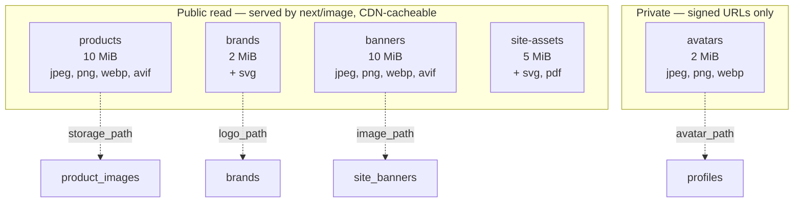
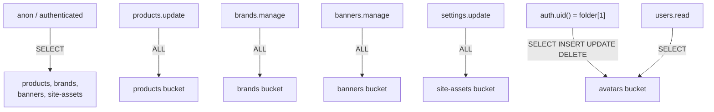

# Storage architecture

Five buckets, created in SQL rather than declared in `config.toml` so the same
definition applies to the local stack and every hosted environment. A bucket
that exists locally but not in production is a class of bug that only appears
after deploy.

---

## Buckets



| Bucket        | Public | Size limit | Allowed MIME types                                    | Referenced by                  |
| ------------- | ------ | ---------: | ----------------------------------------------------- | ------------------------------ |
| `products`    | yes    |     10 MiB | `image/jpeg`, `image/png`, `image/webp`, `image/avif` | `product_images.storage_path`  |
| `brands`      | yes    |      2 MiB | above + `image/svg+xml`                               | `brands.logo_path`             |
| `banners`     | yes    |     10 MiB | `image/jpeg`, `image/png`, `image/webp`, `image/avif` | `site_banners.image_path`      |
| `site-assets` | yes    |      5 MiB | above + `image/svg+xml`, `application/pdf`            | favicons, OG images, documents |
| `avatars`     | **no** |      2 MiB | `image/jpeg`, `image/png`, `image/webp`               | `profiles.avatar_path`         |

---

## Why the split

**Catalog imagery is public.** It is rendered by `next/image` on anonymous
pages. A private bucket would require a signed URL per image per request, which
defeats CDN caching and puts a Supabase round trip in front of every product
photo. `next.config.ts` already restricts the image optimiser to this project's
storage host, so the exposure is "our own public catalog imagery is public" —
which is the intent.

**An avatar is personal data.** Served through a signed URL, scoped to its
owner. The asymmetry is deliberate: catalog imagery is marketing, a photograph
of a person is not.

**MIME allow-lists are a security control, not tidiness.** An unrestricted
public bucket accepting `text/html` turns the project's storage domain into a
host for arbitrary pages — served from an origin users have reason to trust.
Size limits are set per bucket from what the content actually needs: 10 MiB for
a full-width hero, 2 MiB for a logo.

---

## Paths, not URLs

Every column pointing at storage holds an **object path**, never a URL.

```
profiles.avatar_path         →  avatars/<user-id>/avatar.webp
product_images.storage_path  →  products/<product-id>/01.webp
brands.logo_path             →  brands/<brand-id>/logo.svg
site_banners.image_path      →  banners/<banner-id>/hero.webp
```

A URL embeds the project host, so every stored URL would break on a project
move, a custom domain, or a CDN change. A path survives all three; the host is
supplied at render time by the Supabase client.

---

## Object policies — 10 on `storage.objects`



| Policy                                  | Command | Role                    | Condition                                                    |
| --------------------------------------- | ------- | ----------------------- | ------------------------------------------------------------ |
| anyone reads public catalog buckets     | SELECT  | `anon`, `authenticated` | `bucket_id IN ('products','brands','banners','site-assets')` |
| `products.update` writes product images | ALL     | `authenticated`         | `bucket_id = 'products'` + permission                        |
| `brands.manage` writes brand logos      | ALL     | `authenticated`         | `bucket_id = 'brands'` + permission                          |
| `banners.manage` writes banner images   | ALL     | `authenticated`         | `bucket_id = 'banners'` + permission                         |
| `settings.update` writes site assets    | ALL     | `authenticated`         | `bucket_id = 'site-assets'` + permission                     |
| owner reads own avatar                  | SELECT  | `authenticated`         | `(storage.foldername(name))[1] = auth.uid()::text`           |
| owner writes own avatar                 | INSERT  | `authenticated`         | same                                                         |
| owner replaces own avatar               | UPDATE  | `authenticated`         | same                                                         |
| owner deletes own avatar                | DELETE  | `authenticated`         | same                                                         |
| `users.read` reads any avatar           | SELECT  | `authenticated`         | `bucket_id = 'avatars'` + permission                         |

**Writes reuse the same `has_permission()` calls as the table policies.** A
`catalog_manager` who can edit a product can upload its photographs; revoking
the role revokes both in one action. There is no separate storage permission
vocabulary to drift out of sync with the table one.

### Avatar folder scoping

Objects live at `avatars/<user-id>/<filename>`, so the first path segment _is_
the owner. `storage.foldername(name)` splits the path; `[1]` is that segment.

```sql
(storage.foldername(name))[1] = (select auth.uid())::text
```

Without this, any authenticated user could enumerate every avatar in the
bucket. The `users.read` policy is the deliberate exception — support needs to
see a customer's avatar when resolving an impersonation or abuse report, and it
is gated on the same permission that reads the profile the avatar belongs to.

---

## Known gap

> **K-8 — storage policies are unverified at runtime.** They parse and are
> structurally correct, but the Phase 2 validation harness stubs the `storage`
> schema, so `storage.objects` RLS was never exercised against real Supabase
> Storage. Avatar folder-scoping in particular is unproven.
>
> Verify on the first real `supabase start`: sign in as two accounts, upload an
> avatar as each, and confirm neither can read the other's object.

---

## Uploads in later phases

No upload path exists yet — there is no admin UI (Phase 6) and no account UI
(Phase 5). When they arrive:

| Bucket        | Uploaded from         | Phase |
| ------------- | --------------------- | ----- |
| `products`    | Admin product editor  | 6     |
| `brands`      | Admin brand editor    | 6     |
| `banners`     | Admin banner editor   | 6     |
| `site-assets` | Admin settings screen | 6     |
| `avatars`     | Customer profile page | 5     |

Deleting a `product_images` row does **not** delete the underlying object —
`ON DELETE CASCADE` governs the database row only. Orphaned object cleanup is a
Phase 6 concern and belongs in the service that owns the delete, so the two
happen in one place.
